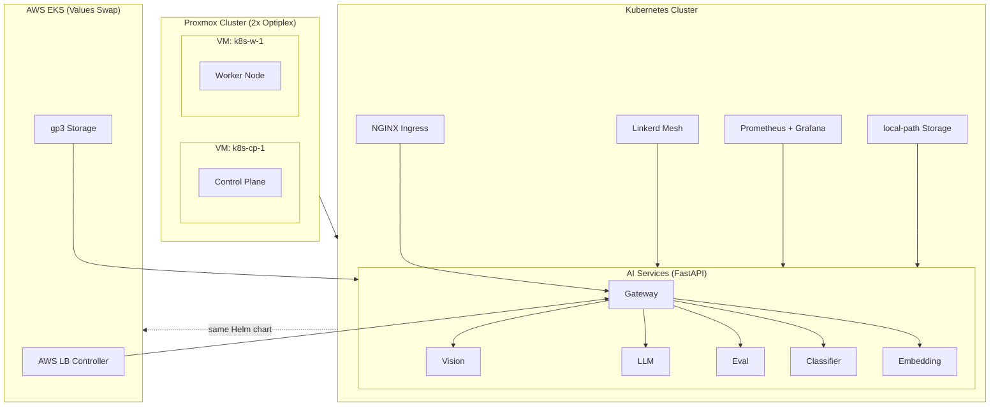

# Architecture (Proxmox + EKS)

```mermaid
flowchart TB
  subgraph Proxmox["Proxmox Cluster (2x Optiplex)"]
    subgraph VM1["VM: k8s-cp-1"]
      CP[Control Plane]
    end
    subgraph VM2["VM: k8s-w-1"]
      WK[Worker Node]
    end
  end

  subgraph K8s["Kubernetes Cluster"]
    IN[NGINX Ingress]
    SM[Linkerd Mesh]
    OBS[Prometheus + Grafana]
    ST[local-path Storage]

    subgraph SVC["AI Services (FastAPI)"]
      GW[Gateway]
      EM[Embedding]
      CL[Classifier]
      EV[Eval]
      LM[LLM]
      VI[Vision]
    end
  end

  subgraph EKS["AWS EKS (Values Swap)"]
    EKSIN[AWS LB Controller]
    EKST[gp3 Storage]
  end

  Proxmox --> K8s
  IN --> GW
  GW --> EM
  GW --> CL
  GW --> EV
  GW --> LM
  GW --> VI
  SM --> SVC
  OBS --> SVC
  ST --> SVC

  K8s -. same Helm chart .-> EKS
  EKSIN --> GW
  EKST --> SVC
```
